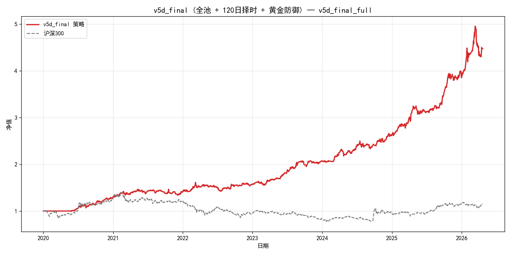

# A-Share ETF Rotation Strategy — v5d (Risk Parity × Momentum Resonance × Regime Filter)

[](./LICENSE)
[](https://www.python.org/)
[](#backtest-results)
[](#backtest-results)
[](#backtest-results)
[](#isoos-discipline)

> **一个基于 "风险平价 + 动量共振 + 大盘趋势择时 + 黄金防御" 的 A 股 ETF 周度轮动策略。**
>
> A rules-based weekly A-share ETF rotation strategy built on **Risk Parity × Momentum Resonance × 120-day HS300 regime filter × Gold defensive overlay**.

---

## 📑 目录 / Table of Contents

- [Strategy Overview / 策略概览](#strategy-overview--策略概览)
- [Backtest Results / 回测结果](#backtest-results)
- [IS/OOS Discipline / 样本内外纪律](#isoos-discipline)
- [Quick Start / 快速开始](#quick-start--快速开始)
- [Core Pipeline / 核心流程](#core-pipeline--核心流程)
- [Repository Structure / 目录结构](#repository-structure--目录结构)
- [Parameter Selection / 参数选取](#parameter-selection--参数选取)
- [Limitations / 已知局限](#limitations--已知局限)
- [References / 参考文献](#references--参考文献)
- [License / 许可证](#license--许可证)
- [Disclaimer / 免责声明](#disclaimer--免责声明)

---

## Strategy Overview / 策略概览

**中文**

v5d 是在 v2（纯风险平价 + 动量共振）基础上叠加**大盘 regime 滤波**与**黄金防御**的终极版：

1. 每周五调仓，先检查 **沪深 300 过去 120 日累计收益**：
   - < **-8%** → 全仓切 **518880 黄金 ETF**（bear 防御）
   - ≥ **-8%** → 进入正常进攻流程
2. 进攻流程：`动态 universe → 波动率过滤 [0.08, 0.28] → 取相关性最低 5 只 → 动量共振评分取 Top 3 → logbias/RSI 过热剔除 → 按 1/σ 倒数加权`
3. 周一到周四做**日内高低切**：过热持仓切至候选池低位，降低 holding-risk

**English**

v5d layers a **market-wide regime filter + gold defensive overlay** on top of the v2 risk-parity-plus-momentum-resonance backbone. Each Friday:

1. Check HS300 120-day return. If < −8%, flip 100% into Gold ETF (518880).
2. Otherwise run the offense cycle: dynamic universe → annualized-vol filter → lowest mean-|ρ| top-5 → momentum-resonance top-3 → overheat filter → inverse-vol weighting.
3. Mon–Thu, daily high-low switch replaces overheated holdings with coolest candidates.

---

## Backtest Results

**回测窗口 / Window: 2020-01-01 ~ 2026-04-21 (6.3 years)**
**基准 / Benchmark: CSI 300 (510300.SH)**
**手续费 / Cost: 5 bp per side**

| Metric / 指标       | **v5d**     | v2 baseline | CSI 300 |
|---------------------|-------------|-------------|---------|
| Annual Return 年化  | **28.11%**  | 27.82%      | 2.35%   |
| Sharpe              | **1.87**    | 1.79        | 0.19    |
| Max Drawdown 最大回撤 | **−13.22%** | −13.21%     | −45.10% |
| Calmar              | **2.13**    | 2.11        | 0.05    |
| Cumulative NAV 6.3y | **≈4.49**   | 4.41        | 1.15    |



---

## IS/OOS Discipline

**严格按照 "IS 选参、OOS 只读" 原则 / Strict IS-for-tuning, OOS-read-only discipline**

| Window                | Annual | Sharpe   | MaxDD     | Calmar   |
|-----------------------|--------|----------|-----------|----------|
| IS  2018-2023 (tuning)| 23.78% | 1.60     | −17.12%   | 1.39     |
| **OOS 2024-2026.4 (read-only)** | **34.32%** | **2.12** | **−13.22%** | **2.60** |
| Full 2020-2026.4      | 28.11% | 1.87     | −13.22%   | 2.13     |

**OOS / IS Sharpe ≈ 1.33** → 远高于 0.6 过拟合阈值，泛化良好。
**OOS / IS Sharpe ≈ 1.33** → well above the 0.6 overfitting threshold, indicating strong generalization.

---

## Quick Start / 快速开始

```bash
# 1. Clone
git clone https://github.com/<your-name>/A-Share-ETF-Rotation-v5d.git
cd A-Share-ETF-Rotation-v5d

# 2. Install
pip install -r requirements.txt

# 3. Run Full + IS + OOS (三窗口一键复现)
python scripts/run_v5d_final.py

# 4. (Optional) Re-run IS 36-combo grid search
python scripts/grid_search_v5d.py
```

首次运行需拉取 64 只 ETF 历史行情（约 5–10 分钟，之后本地 `cache/` 秒加载）。
First run downloads ~64 ETFs of history (~5–10 min); subsequent runs load from local `cache/` instantly.

---

## Core Pipeline / 核心流程

```
┌──────────────────────────────────────────────────────────────┐
│  WEEKLY (every Friday)                                        │
│  ─────────────────────────────────────────────────────────   │
│  0. Regime check: HS300 120-day return                        │
│     < −8%  →  100% Gold (518880)  [bear defense]              │
│     ≥ −8%  →  offense cycle below                             │
│                                                                │
│  1. Dynamic universe:  min_hist_days ≥ 90                     │
│  2. Volatility filter: σ_annual ∈ [0.08, 0.28]                │
│  3. Correlation filter: mean |ρ| lowest → top-5 candidates    │
│  4. Momentum resonance: score = (e^(β·252)−1) · R²            │
│                          → top-3                              │
│  5. Overheat filter: logbias > class threshold                │
│                      OR (RSI14 > 78 AND declining)            │
│  6. Inverse-vol weighting:  w_i ∝ 1/σ_i                       │
└──────────────────────────────────────────────────────────────┘

┌──────────────────────────────────────────────────────────────┐
│  INTRADAY HIGH-LOW SWITCH (Mon–Thu, offense only)             │
│  ─────────────────────────────────────────────────────────   │
│  For each holding:                                             │
│    if logbias > class_threshold                                │
│       OR (RSI14 > 78 AND RSI declining):                      │
│          swap with lowest-logbias non-overheated candidate    │
│          rebalance by inv-vol                                  │
└──────────────────────────────────────────────────────────────┘
```

### 关键指标公式 / Key Formulas

| Factor           | Formula                                                       |
|------------------|---------------------------------------------------------------|
| Annual Vol       | σ = std(daily_ret_180) × √252                                 |
| Mean Abs Corr    | ρ̄_i = (1/(N−1)) · Σ_{j≠i} \|ρ_ij\|  on 500-day window        |
| Momentum Score   | score = (exp(β·252) − 1) · R²   from OLS ln(P) ~ t over 20d   |
| LogBias          | (ln P − ln EMA30) × 100                                       |
| RSI14            | Wilder smoothing, α = 1/14                                    |
| Regime signal    | r_120 = HS300.close[t] / HS300.close[t−120] − 1               |

### Overheat Thresholds / 过热阈值

| Class       | LogBias threshold | RSI14 rule                 |
|-------------|-------------------|----------------------------|
| stock       | 16.5              | > 78 AND RSI 下行          |
| commodity   | 11.0              | > 78 AND RSI 下行          |
| dividend    | 6.0               | > 78 AND RSI 下行          |
| bond        | ∞ (disabled)      | —                          |

---

## Repository Structure / 目录结构

```
A-Share-ETF-Rotation-v5d/
├── README.md                       # this file
├── LICENSE                         # MIT
├── requirements.txt
├── .gitignore
│
├── docs/
│   └── STRATEGY.md                 # ⭐ Full strategy write-up (11 chapters)
│
├── src/                            # core library
│   ├── strategy_a_share_etf_rotation.py   # v1: risk parity + momentum base
│   ├── strategy_v2_high_low_switch.py     # v2: logbias/RSI overheat + high-low switch
│   └── strategy_v5_aggressive.py          # v5: regime filter + gold defense
│
├── scripts/                        # runners
│   ├── run_v5d_final.py            # ⭐ one-click reproduce (Full / IS / OOS)
│   └── grid_search_v5d.py          # IS 36-combo parameter scan
│
├── results/                        # backtest artifacts (CSV)
│   ├── nav_v5d_final_{full,is,oos}.csv
│   ├── rebalances_v5d_final_{full,is,oos}.csv
│   ├── switch_v5d_final_{full,is,oos}.csv
│   ├── metrics_v5d_final_{full,is,oos}.csv
│   ├── grid_search_v5d_is.csv               # full 36-combo scan result
│   └── nav_v5d_lb120_th-{0.03,0.05,0.08}_518880_n3_full.csv
│
├── figures/                        # NAV & comparison plots (PNG)
│   ├── nav_v5d_final_{full,is,oos}.png
│   └── v5d_final_comparison.png
│
└── .github/workflows/
    └── smoke.yml                   # (optional) CI smoke test
```

---

## Parameter Selection / 参数选取

所有参数均由 **IS 2018-2023 的 36 组网格扫描**严格选出，OOS 2024-2026.4 不参与调参：
All parameters are selected strictly from the IS 2018-2023 36-combo grid scan; OOS (2024-2026.4) is read-only.

**Search grid**:
```python
lookback   ∈ {60, 90, 120}
threshold  ∈ {-0.03, -0.05, -0.08}
defensive  ∈ {518880.SH gold, 511090.SH 30Y bond}
n_momentum ∈ {2, 3}
```

**IS Top 3 by Sharpe (all gold defense)**:

| lookback | threshold | n_mom | defensive | IS Ann | IS Sharpe | IS DD    | IS Calmar |
|----------|-----------|-------|-----------|--------|-----------|----------|-----------|
| **120**  | **−0.08** ⭐ | **3** | 518880    | 23.78% | **1.60**  | −17.12%  | 1.39      |
| 120      | −0.05     | 3     | 518880    | 22.97% | 1.59      | −17.12%  | 1.34      |
| 120      | −0.03     | 3     | 518880    | 22.82% | 1.57      | −17.14%  | 1.33      |

**Observations / 关键观察**:
- IS Top 10 are **all gold defensive** (gold > 30Y bond for A-share bear markets).
- IS Top 5 are **all lookback = 120** (long window reduces whipsaw in sideways regimes).
- IS Top 5 are **all n_momentum = 3** (cross-border + A-share + commodity multi-Alpha needs a bigger slot).

Full result: [`results/grid_search_v5d_is.csv`](./results/grid_search_v5d_is.csv).

### Final Parameters / 最终参数

```python
ParamsV5(
    # Risk parity + momentum (inherited)
    init_cash=1_000_000,
    vol_window=180, corr_window=500, momentum_window=20,
    vol_low=0.08, vol_high=0.28,
    n_corr=5, n_momentum=3,
    rebalance_freq='W-FRI',
    transaction_cost=0.0005,
    weighting="inv_vol",

    # v2 overheat filter + intraday high-low switch
    ema_window=30, rsi_window=14, rsi_overheat=78.0,
    enable_high_low_switch=True,

    # v5d regime filter (IS-selected)
    enable_regime_filter=True,
    regime_lookback=120,
    regime_threshold=-0.08,
    regime_defensive_etf="518880.SH",
)
```

---

## Limitations / 已知局限

- **120-day lookback 对 V 型急跌反应不够快**：2020-03 疫情期最大回撤 −13.22% 并未被 regime 滤波避开（滤波本身在 Q2 尾段才触发）。这是长窗口与稳态择时的固有 trade-off。
  The 120-day lookback cannot dodge V-shaped crashes like 2020-03 COVID — this is the inherent trade-off of a long, stable regime window.

- **Regime 以 HS300 为锚**：若 HS300 失灵（例如未来小盘独立崩盘而宽基稳定），防御不会触发。
  The regime signal is anchored to HS300; idiosyncratic small-cap crashes that don't drag HS300 won't trigger defense.

- **黄金 ETF 518880 本身的风险未建模**：黄金极端行情下也可能回撤（历史 <−10% 事件少但存在）。
  Gold (518880) is not itself risk-free and can draw down in extreme regimes.

- **手续费 5 bp、无滑点模型**：实盘流动性差的行业 ETF 可能有 1–3 bp 额外滑点。
  Cost modeled at 5 bp per side, no slippage; thin sector ETFs may incur 1–3 bp additional slippage in live trading.

- **IS 仅 6 年 + OOS 仅 2.3 年**：样本量有限，regime 参数 (120, −8%) 在更长历史上未验证。
  IS is 6 years, OOS is 2.3 years — regime params not validated over longer history.

---

## References / 参考文献

- Moskowitz, Ooi & Pedersen (2012). *Time Series Momentum*. Journal of Financial Economics.
- Faber, M. (2007). *A Quantitative Approach to Tactical Asset Allocation*. Cambria Investment.
- Wilder, J. W. (1978). *New Concepts in Technical Trading Systems*. (RSI definition)
- Asness, Moskowitz & Pedersen (2013). *Value and Momentum Everywhere*. Journal of Finance.
- Liu Chenming (GF Securities) — LogBias sector overheat framework.

---

## License / 许可证

MIT License. See [LICENSE](./LICENSE).

Citation / 引用:
```
@software{v5d_etf_rotation_2026,
  title  = {A-Share ETF Rotation Strategy v5d (Risk Parity × Momentum × Regime Filter)},
  author = {Hu, Y.},
  year   = {2026},
  url    = {https://github.com/huyukun662-crypto/A-Share-ETF-Rotation-v5d}
}
```

---

## Disclaimer / 免责声明

> 本策略及代码仅供量化研究、学习交流用途。过往业绩不代表未来表现。A 股 ETF 投资存在市场风险、流动性风险、跟踪误差、政策变动风险等。Regime 滤波基于历史统计规律，极端行情（如 2020-03 V 型急跌）下保护效果有限。投资者需自行做好资金管理和风险控制，谨慎决策。作者不承担因使用本代码导致的任何投资损失。
>
> This strategy and code are for quantitative research and educational purposes only. Past performance does not guarantee future results. A-share ETF investing involves market, liquidity, tracking-error, and regulatory risks. The regime filter is based on historical statistics and offers limited protection in extreme V-shaped crashes (e.g., 2020-03 COVID). Investors must manage their own position sizing and risk. The author bears no liability for any investment losses arising from the use of this code.
