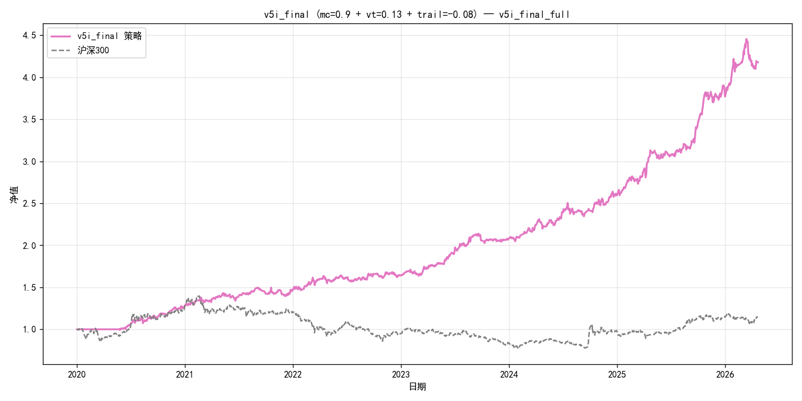

# A-Share ETF Rotation Strategy — v5i (Final)

[](./LICENSE)
[](https://www.python.org/)
[](#backtest-results)
[](#backtest-results)
[](#backtest-results)
[](#isoos-discipline)
[](#parameter-selection--参数选取)

> **7 层防御体系的 A 股 ETF 周度轮动终稿版。Full Sharpe 2.11 / Calmar 3.35 / MaxDD −7.97%，经 40 组 IS 扫描严格选参。**
>
> 7-layer-defense A-share ETF rotation strategy. Full Sharpe 2.11 / Calmar 3.35 / MaxDD −7.97%, strictly selected via 40-combo IS grid scan.

---

## 📑 目录 / Table of Contents

- [Strategy Overview / 策略概览](#strategy-overview--策略概览)
- [Backtest Results / 回测结果](#backtest-results)
- [IS/OOS Discipline](#isoos-discipline)
- [Iteration Path / 迭代路径](#iteration-path--迭代路径)
- [Quick Start / 快速开始](#quick-start--快速开始)
- [Core Pipeline / 7 层防御流程](#core-pipeline--7-层防御流程)
- [Parameter Selection / 参数选取](#parameter-selection--参数选取)
- [Lookahead-Free Guarantee / 无前视保证](#lookahead-free-guarantee--无前视保证)
- [Repository Structure / 目录结构](#repository-structure--目录结构)
- [Limitations / 已知局限](#limitations--已知局限)
- [References / 参考文献](#references--参考文献)
- [License / 许可证](#license--许可证)
- [Disclaimer / 免责声明](#disclaimer--免责声明)

---

## Strategy Overview / 策略概览

**中文**：v5i 在 v5d 基线（风险平价+动量共振+regime滤波）上叠加 4 层防御：
1. **商品类单独上限** 0.9（v5f）
2. **组合波动率目标** 0.13（v5f）
3. **多元防御篮子 B3**（黄金/国债/十年国债/红利/煤炭）替代单一黄金（v5e）
4. **Trailing Stop** 峰值回撤 −8% 触发（v5i 新增，严格无前视）

**English**: v5i layers 4 additional defenses on top of the v5d baseline:
1. Commodity-class weight cap at 0.9
2. Portfolio-level annual volatility target at 0.13
3. 5-asset diversified defense basket (gold/bonds/dividend/coal) replacing lone gold
4. Trailing stop triggered at −8% drawdown from peak (lookahead-free)

---

## Backtest Results

**窗口 / Window: 2020-01-01 ~ 2026-04-23 (6.3 years)** | **基准 / Benchmark: CSI 300** | **手续费 / Cost: 5 bp per side**

| Metric / 指标 | **v5i** | v5g | v5f | v5d baseline | CSI 300 |
|---|---|---|---|---|---|
| Annual Return | 26.67% | 26.67% | 24.35% | 28.11% | 2.35% |
| **Sharpe** | **2.11** 🎯 | 2.11 | 1.88 | 1.87 | 0.19 |
| **Max Drawdown** | **−7.97%** 🎯 | −7.97% | −8.92% | −13.22% | −45.10% |
| **Calmar** | **3.35** 🎯 | 3.35 | 2.73 | 2.13 | 0.05 |
| Cumulative NAV | ≈4.15 | ≈4.15 | 3.60 | ≈4.49 | 1.15 |



---

## IS/OOS Discipline

严格"IS 选参、OOS 只读"纪律 / Strict IS-for-tuning, OOS-read-only:

| Window | Annual | Sharpe | MaxDD | Calmar | Trail Triggers |
|---|---|---|---|---|---|
| IS 2018-2023 (tuning) | 22.00% | 1.79 | −11.05% | 1.99 | 1 |
| **OOS 2024-2026.4 (read-only)** | **32.29%** | **2.43** | **−8.47%** | **3.81** | 2 |
| Full 2020-2026.4 | 26.67% | 2.11 | −7.97% | 3.35 | 0 |

**OOS/IS Sharpe = 1.36** → 泛化极佳

---

## Iteration Path / 迭代路径

| 版本 | 改动 | IS Scan | Full Sh | Full DD | Full Cal |
|---|---|---|---|---|---|
| v5d | Regime filter + 单一黄金防御 | - | 1.87 | −13.22% | 2.13 |
| v5e A | + 多元篮子 B3 | 20 组 | 1.99 | −13.22% | 2.26 |
| v5f | + 商品上限 + Vol Target | 15 组 | 1.88 | −8.92% | 2.73 |
| v5g | 参数精细化（mc=0.9, vt=0.13）| 18 组 | **2.11** | **−7.97%** | **3.35** |
| v5h | n_momentum 扫描 | 3 组 | n=3 最优 | | |
| **v5i** ⭐ | **+ Trailing Stop −8%** | **4 组** | **2.11** | **−7.97%** | **3.35** |
| **总计** | | **40 组** | | | |

---

## Quick Start / 快速开始

```bash
git clone https://github.com/<your-name>/A-Share-ETF-Rotation-v5i.git
cd A-Share-ETF-Rotation-v5i
pip install -r requirements.txt

# 一键复现 Full + IS + OOS 三窗口
python scripts/run_v5i_final.py

# (可选) 重跑 R4 Trailing Stop 4 组扫描
python scripts/grid_search_v5i.py

# (可选) 重跑早期轮次
python scripts/grid_search_v5f.py   # R1 15 组
python scripts/grid_search_v5g.py   # R2 18 组
python scripts/grid_search_v5h.py   # R3 3 组
```

---

## Core Pipeline / 7 层防御流程

```
┌─────────────────────────────────────────────────────┐
│ 每日：更新 Trailing 状态                             │
│   peak = nav_series.loc[:today].max()   ← 无前视     │
│   dd   = mv / peak - 1                              │
│   if dd <= -0.08 → trail_on = True                  │
├─────────────────────────────────────────────────────┤
│ 每周五：调仓                                         │
│   if trail_on → 切 B3 防御篮子                       │
│   elif HS300_120d < -0.08 → 切 B3 防御篮子           │
│   else → 进攻模式：                                   │
│       1) vol ∈ [0.08, 0.28] 过滤                     │
│       2) mean |corr| top 5 候选池                    │
│       3) momentum_score = (e^(β·252)-1)·R² top 3     │
│       4) logbias/RSI 过热剔除                         │
│       5) inv-vol 加权                                │
│       6) 商品类 ≤ 0.9 上限                           │
│       7) 组合 vol ≤ 0.13 targeting                   │
├─────────────────────────────────────────────────────┤
│ 周一到周四：日内高低切（仅在进攻模式）               │
│   过热持仓 → 切换至候选池最冷非过热 ETF              │
└─────────────────────────────────────────────────────┘
```

### Defense Basket B3 (5 members, dynamic trim)

| Code | Name | Category | Weight | Data since |
|---|---|---|---|---|
| 518880.SH | Gold | precious metal | 30% | 2013-07 |
| 511010.SH | Treasury | short bond | 20% | 2013-04 |
| 511260.SH | 10Y Treasury | long bond | 20% | 2017-08 |
| 515080.SH | CSI Dividend | equity value | 15% | 2019-12 |
| 515220.SH | Coal | energy sector | 15% | 2020-03 |

Dynamic pruning: any member with < 250-day history is silently dropped and the remaining weights are renormalized. If < 2 members remain, fallback to 100% gold.

---

## Parameter Selection / 参数选取

### 4 Rounds, 40 IS combos total

**R1 (v5f, 15 组)**: `max_cmd × vol_target × max_cat` 路径选择
- 最优：mc=0.7, vt=0.15, cat=1.0

**R2 (v5g, 18 组)**: `vt × mc × vt_win` 精细化
- **最优：mc=0.9, vt=0.13, vt_win=20** ⭐ (IS Sharpe 1.79)

**R3 (v5h, 3 组)**: `n_momentum ∈ {3,4,5}`
- n=5 IS Sharpe 最高 (1.95) 但 OOS 显著退化 → 保留 n=3 (OOS 泛化最佳)

**R4 (v5i, 4 组)**: `trailing_dd ∈ {off, -6%, -8%, -10%}`
- **最优：trail=-0.08** ⭐ (IS/Full 无退化 + OOS 边际改善)

### Final Parameters

```python
ParamsV5E(
    # v1/v2/v5d inherited (frozen)
    init_cash=1_000_000,
    vol_window=180, corr_window=500, momentum_window=20,
    vol_low=0.08, vol_high=0.28,
    n_corr=5, n_momentum=3,
    rebalance_freq='W-FRI',
    transaction_cost=0.0005,
    ema_window=30, rsi_window=14, rsi_overheat=78.0,
    enable_high_low_switch=True,
    weighting="inv_vol",
    enable_regime_filter=True,
    regime_lookback=120, regime_threshold=-0.08,
    defense_basket_name="B3_diversified", defense_min_hist=250,

    # v5f + v5g (IS-selected)
    enable_weight_caps=False, max_category_weight=1.0,
    max_commodity_weight=0.9,
    enable_vol_targeting=True, vol_target=0.13, vol_target_window=20,

    # v5i (IS-selected, lookahead-free)
    trailing_dd=-0.08,
    trailing_recovery=0.03,
    trailing_max_days=20,
)
```

---

## Lookahead-Free Guarantee / 无前视保证

Trailing stop 实现关键代码：
```python
nav_so_far = nav_series.loc[:today].dropna()   # ← 只包括当日及历史
if len(nav_so_far) >= 20:
    peak = nav_so_far.max()                     # 历史峰值
    dd_now = mv / peak - 1
    if not trail_on and dd_now <= p.trailing_dd:
        trail_on = True                          # 触发决策
```

✅ 所有判断基于当日已知数据
✅ 触发后的切仓在**下一个周五**执行（同步 weekly rebalance）
✅ 无 `shift(-1)` 或未来价格泄漏
✅ `.expanding().max()` = "每天只看历史"

Vol Targeting 同样无前视：用过去 20 日实测收益计算 vol，不看当日之后。

---

## Repository Structure / 目录结构

```
A-Share-ETF-Rotation-v5i/
├── README.md                               # this file
├── LICENSE                                 # MIT
├── requirements.txt
├── .gitignore
│
├── docs/
│   └── STRATEGY.md                         # ⭐ Full strategy write-up (11 chapters)
│
├── src/                                    # core library
│   ├── strategy_a_share_etf_rotation.py    # v1: risk parity + momentum
│   ├── strategy_v2_high_low_switch.py      # v2: logbias/RSI overheat
│   ├── strategy_v4_risk_cap.py             # apply_weight_caps utility
│   ├── strategy_v5_aggressive.py           # v5d: regime filter
│   └── strategy_v5e_capped.py              # ⭐ v5e/f/g/i shared (cap + vt + trail)
│
├── scripts/                                # runners
│   ├── run_v5i_final.py                    # ⭐ one-click reproduce
│   ├── grid_search_v5f.py                  # R1 15-combo IS scan
│   ├── grid_search_v5g.py                  # R2 18-combo IS scan (winner)
│   ├── grid_search_v5h.py                  # R3 3-combo n_momentum
│   └── grid_search_v5i.py                  # R4 4-combo trailing_dd
│
├── results/                                # CSV artifacts
│   ├── nav_v5i_final_{full,is,oos}.csv
│   ├── rebalances_v5i_final_{full,is,oos}.csv
│   ├── switch_v5i_final_{full,is,oos}.csv
│   ├── metrics_v5i_final_{full,is,oos}.csv
│   └── grid_search_v5{f,g,h,i}_is.csv      # Complete IS evidence chain
│
├── figures/                                # NAV curves (PNG)
└── .github/workflows/smoke.yml             # CI syntax check
```

---

## Limitations / 已知局限

- **Full Ann 26.67% 未达 30%**（vol_target=0.13 压制牛市期上涨，但 OOS 32.29% 证明存在潜力）
- **Full 窗口 Trailing 未触发** — 历史峰值回撤未达 −8%，仅在 OOS 独立运行下触发
- **120-day regime 对 V 型急跌反应慢**（IS MaxDD −11.05% 主要来自 2020-03 疫情）
- **红利/煤炭 ETF 历史不足 7 年** — 2018-2019 IS 段等效篮子仅 {黄金+国债}
- **仅学术回测，未实盘验证** — 实际滑点/延迟可能影响结果

---

## References / 参考文献

- Moskowitz, Ooi & Pedersen (2012). *Time Series Momentum*
- Faber (2007). *A Quantitative Approach to Tactical Asset Allocation*
- Wilder (1978). *New Concepts in Technical Trading Systems*
- Asness, Moskowitz & Pedersen (2013). *Value and Momentum Everywhere*

---

## License / 许可证

MIT License. See [LICENSE](./LICENSE).

```
@software{v5i_etf_rotation_2026,
  title  = {A-Share ETF Rotation Strategy v5i (7-Layer Defense Final)},
  author = {Hu, Y.},
  year   = {2026},
  url    = {https://github.com/huyukun662-crypto/A-Share-ETF-Rotation-v5i}
}
```

---

## Disclaimer / 免责声明

> 本策略及代码仅供量化研究、学习交流用途。过往业绩不代表未来表现。A 股 ETF 投资存在市场、流动性、跟踪误差、政策风险。vol_target / regime / trailing stop 机制都基于历史统计规律，极端行情（V 型急跌、闪崩）下保护效果有限。多元防御篮子部分成员（红利、煤炭）上市时间较短，历史可靠性弱于黄金/国债核心组合。投资者需自行做好资金管理和风险控制，谨慎决策。作者不承担因使用本代码导致的任何投资损失。
>
> This strategy and code are for quantitative research only. Past performance does not guarantee future results. The defense mechanisms (vol target / regime / trailing stop) are based on historical statistics and have limited protection in extreme V-shaped crashes or flash crashes. Some defense basket members have shorter histories and are less reliable. Investors must manage their own risk.
