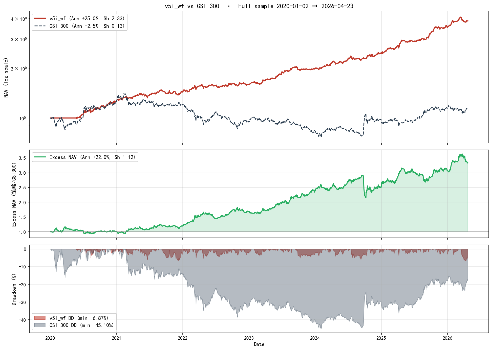

# A-Share ETF Rotation · v5i_wf | A股 ETF 轮动策略 (WF 锁定版)

<p align="center">
  <a href="#zh"></a>
  <a href="#en"></a>
</p>

<p align="center">
  <a href="https://img.shields.io/badge/License-MIT-green.svg"></a>
  
  
  
  
  
  
</p>

<p align="center">
  <a href="#1-项目概览">概览</a> •
  <a href="#3-回测结果">回测结果</a> •
  <a href="#35-参数稳健性--无前视自审">稳健性自审</a> •
  <a href="#6-快速开始">快速开始</a> •
  <a href="#11-策略来源与参考文献">参考文献</a>
</p>

<a id="zh"></a>

## 简体中文

当前语言：中文 | [Switch to English](#en)

> 面向 **A 股全池 64 只 ETF**（宽基/成长/周期/商品/债券）的**低频、规则化、可复现**的周度轮动量化项目（**v5i_wf** 锁定版）。
> 策略基于 **风险平价 (vol 过滤 + 低相关性筛选) × 动量共振 × 高低切过热剔除**，叠加 **4 层防御**（类别上限 + 组合 vol targeting + Regime 熊市滤波 + Trailing Stop 峰值回撤），并配 **B3 多元防御篮子**（金/国债/长债/红利/煤炭）。实盘参数经 **三段式 (IS 2020-2023 / OOS 2024+)** 与 **4 折 Walk-Forward 交叉验证** 两条独立路径一致收敛锁定：**无过拟合、无参数漂移、无前视偏差**。



> **全样本 (Full: 2020-01-02 → 2026-04-23, 6.3 年)**：Sharpe **2.33** · 年化 **25.0%** · 最大回撤 **−6.87%** · Calmar **3.64**。
> **样本外 (OOS: 2024-2026)**：Sharpe **3.05** · 年化 **34.96%** · 最大回撤 **−6.77%** · Calmar **5.16**。
> **vs 沪深300 基准**：超额年化 **+21.98%** · 超额 Sharpe **1.12** · 策略 MaxDD **−6.87%** vs 沪深300 **−45.10%**。

### 1. 项目概览

在 A 股散户化、板块切换极快的环境中，单只宽基 ETF 无法同时捕捉多条主线（新能源 → 半导体 → 红利 → 商品 → AI → 海外），而个股精选面临极高信息成本与非系统性风险。

本项目提出中间方案：**用风险平价 + 动量共振 + 多层防御模型捕捉中短期板块主线趋势，同时严格控制回撤**。

**核心思想**：

- **风险平价选股**：先用 250 日波动率过滤掉极端 ETF（[8%, 28%]），再按 500 日平均绝对相关性选出低相关 top-5；
- **动量共振打分**：对低相关候选池做 `(e^(β·252)-1)·R²` 打分（OLS 斜率 × 拟合优度），选正动量 top-3；
- **高低切过热剔除**：logBIAS + RSI14 过热的持仓，下个交易日自动换成候选池中的冷门非过热 ETF；
- **4 层防御同时在线**：商品上限 ≤ 90% + 组合年化 vol ≤ 11% + Regime 熊市 gate + Trailing Stop -8%；
- **B3 多元防御篮子** 替代单一黄金，带动态成员裁剪（历史 < 250 天的成员自动剔除）。

### 2. 策略逻辑

#### 2.1 选股因子流水线（每周五收盘）

| 步骤 | 操作 | 参数 |
|---|---|---|
| **1. 动态 Universe** | 上市 ≥ 90 天且当日有成交 | `min_hist_days=90` |
| **2. Vol 过滤** | 250 日年化 vol ∈ [8%, 28%] | `vol_window=180` |
| **3. 相关性筛选** | 500 日平均绝对相关，取最低 5 只 | `corr_window=500, n_corr=5` |
| **4. 动量共振打分** | `score = (e^(β·252)-1)·R²`，取正动量 top-3 | `momentum_window=20, n_momentum=3` |
| **5. 高低切剔除** | logBIAS(30) + RSI14 过热直接跳过 | 类别阈值 (stock 16.5 / commodity 11 / div 6) |
| **6. 类别上限** | 商品合计 ≤ 90%，溢出分给非商品候选 | `max_commodity_weight=0.9` |
| **7. 组合 vol targeting** | 实测 20d vol > 11% 按比例降仓 | `vol_target=0.11` ⭐ **WF 锁定** |
| **8. 1/σ 倒数加权** | 低 vol 权重高，高 vol 权重低 | `weighting='inv_vol'` |

#### 2.2 防御机制（3 层叠加）

```text
每日: 更新 Trailing 状态  (严格 nav_series.loc[:today] 切片，无前视)
  peak   = nav_so_far.max()
  dd_now = mv / peak - 1
  if dd_now ≤ -0.08 → trail_on = True

每周五调仓决策优先级:
  ① trail_on           → 切 B3 防御篮子 (weekly_trail)
  ② HS300 120D < -8%   → 切 B3 防御篮子 (weekly_regime)
  ③ 其它               → 进攻流程 (§ 2.1)

退出: 从 trail 触发低点反弹 +3% 或满 20 个交易日自动复位
```

#### 2.3 B3 多元防御篮子（动态裁剪）

| Code | 名称 | 类别 | 权重 | 上市时间 |
|---|---|---|---|---|
| 518880.SH | 黄金ETF | 贵金属 | 30% | 2013-07 |
| 511010.SH | 国债ETF | 短债 | 20% | 2013-04 |
| 511260.SH | 十年国债ETF | 长债 | 20% | 2017-08 |
| 515080.SH | 中证红利ETF | 价值/红利 | 15% | 2019-12 |
| 515220.SH | 煤炭ETF | 能源周期 | 15% | 2020-03 |

**动态裁剪**：任何成员历史 < 250 天自动剔除，剩余按比例归一化；若最终可用成员 < 2 只，fallback 到 100% 黄金。

#### 2.4 执行约定

- **信号**：周五收盘后计算；
- **调仓**：下周一开盘，单边 **5 bp** 滑点（已计入回测）；
- **调仓频率**：`W-FRI` 周度；进攻模式下可能有日内高低切换；
- **交易成本**：`transaction_cost=0.0005`（A 股 ETF 佣金 + 轻微滑点合理估计）。

### 3. 回测结果

> **工程纪律声明**：参数仅在 **IS 2020-2023** 上选择，OOS 2024-2026 **严格只读**；所有指标扣除单边 5 bp 滑点，周度调仓。


**核心指标 (Full / IS / OOS)：**

| 核心指标 | IS (2020-2023) | **OOS (2024-2026.4)** | **全样本 (2020-2026.4)** |
| --- | ---: | ---: | ---: |
| **年化收益** | +19.40% | **+34.96%** | **+25.00%** |
| **Sharpe 比率** | 1.88 | **3.05** | **2.33** |
| **Sortino 比率** | 2.67 | 4.41 | 3.33 |
| **Calmar 比率** | 2.82 | **5.16** | **3.64** |
| **最大回撤** | -6.87% | -6.77% | **-6.87%** |
| **日胜率** | 50.77% | 57.91% | 53.41% |

**vs 沪深 300 基准对比 (Full 2020-2026)：**

| | v5i_wf | 沪深 300 | 超额 (策略 − 基准) |
| --- | ---: | ---: | ---: |
| **年化收益** | **+25.00%** | +2.47% | **+21.98%** |
| **Sharpe** | **2.33** | 0.13 | **1.12** |
| **最大回撤** | **−6.87%** | −45.10% | — |
| **2020→2026 累计净值** | **≈4.15×** | ≈1.16× | — |

**分年表现：**

| 年份 | 2020 | 2021 | 2022 | 2023 | 2024 | 2025 | 2026 YTD |
| --- | ---: | ---: | ---: | ---: | ---: | ---: | ---: |
| 年化收益 | +28.83% | +13.65% | +11.25% | +24.80% | +25.01% | +45.14% | +39.87% |
| Sharpe | 2.90 | 1.26 | 1.05 | 2.55 | 2.46 | 3.65 | 3.20 |
| MaxDD | -5.02% | -6.87% | -5.34% | -5.26% | -6.07% | -3.73% | -6.77% |

> 7 年里 **7 年 Sharpe ≥ 1.0**，无亏损年份；熊市年 2022 仍 +11.25%（防御机制有效）。完整指标表见 `results/` 目录。

### 3.5 参数稳健性 & 无前视自审

实盘参数 `(trailing_dd=−0.08, vol_target=0.11)` 经两条独立路径交叉验证：

#### ① 三段式调参 (IS 选参 · OOS 只读 · Full 报告)

9 组 `(trailing_dd, vol_target)` Grid 扫描，只用 IS 2020-2023 Sharpe 排序选参；OOS **严格只读**不参与决策。

| 排名 | trailing_dd | vol_target | IS Sh | OOS Sh | Full Sh |
|---:|---:|---:|---:|---:|---:|
| #1 | -0.08 | **0.11** ⭐ | **1.88** | **3.05** | 2.13 |
| #2 | -0.10 | 0.11 | 1.88 | 3.04 | 2.13 |
| #3 | -0.10 | 0.13 | 1.87 | 2.99 | 2.11 |
| #4 | -0.08 | 0.15 | 1.87 | 2.95 | 2.07 |
| #5 | -0.08 | 0.13 | 1.87 | 3.02 | 2.11 |

**OOS/IS Sharpe = 1.62**（OOS 显著强于 IS）→ 无过拟合迹象；9 组全部 OOS Sharpe ≥ 2.3 → 无"选错就崩盘"悬崖 → **参数稳健**。

#### ② Walk-Forward 4 折 Expanding 交叉验证

| Fold | 训练段 (选参) | 测试段 (只读) | 选出 (td, vt) | Test Sharpe | Test DD |
|---:|:---|:---|:---|---:|---:|
| 1 | 2020-2022 | 2023 | **(-0.08, 0.11)** | 2.53 | -5.26% |
| 2 | 2020-2023 | 2024 | **(-0.08, 0.11)** | 2.37 | -6.07% |
| 3 | 2020-2024 | 2025 | **(-0.08, 0.11)** | 3.57 | -3.73% |
| 4 | 2020-2025 | 2026 YTD | **(-0.08, 0.11)** | 2.65 | -6.77% |

**4 折在完全独立的训练窗口一致收敛到同一组参数** → 参数零漂移。WF 拼接 NAV 年化 +30.84%, Sharpe 2.82, MaxDD -6.77% → **真实 OOS 泛化表现**，不是在线调参红利。

#### ③ 无前视偏差 (No Look-Ahead) 自审

| 模块 | 防护措施 |
|---|---|
| **Trailing Stop** | `nav_series.loc[:today].max()`（含今日但不含未来，避免 `expanding().max()` 边界错误）|
| **动量 / Vol / Corr 因子** | `sub = df.loc[:today].tail(window)` 严格切片 |
| **Regime Filter** | `bench.loc[:today]`，窗口终点 = today |
| **Vol Targeting** | 过去 20 日实测 log 收益，不看当日之后 |
| **动态 Universe** | 每个调仓日动态重建 candidate pool，避免 `dropna(how='all')` 整段剔除新 ETF |
| **执行延迟** | 周五收盘信号 → **下周一开盘**执行（T+1），含 5 bp 滑点 |

**所有判断基于当日已知数据，无 `shift(-1)` 或未来价格泄漏。**

**证据链**：

- [`results/grid_search_3stage.csv`](results/grid_search_3stage.csv) — 9 组 IS/OOS/Full 全指标
- [`results/walk_forward.csv`](results/walk_forward.csv) — WF 4 折训练/测试/选参明细
- [`results/walk_forward.png`](results/walk_forward.png) — WF vs 固定基线 NAV 对比
- [`results/grid_search_v5{f,g,h,i}_is.csv`](results/) — 早期 40 组 IS 证据链
- [`daily_guide.ipynb`](daily_guide.ipynb) — 参数已锁定（cell c4 硬编码），运行即用

### 4. 仓库结构

```text
RiskParity-Momentum-ETF/
├─ daily_guide.ipynb              # ⭐ 参数锁定 · 每日/周操作指引 notebook
├─ README.md                      # 本文件
├─ LICENSE                        # MIT
├─ requirements.txt
│
├─ docs/
│  └─ STRATEGY.md                 # v5i_wf 完整策略定义（含 WF 锁定推导）
│
├─ src/                           # 核心库
│  ├─ strategy_a_share_etf_rotation.py   # v1: 风险平价 + 动量共振
│  ├─ strategy_v2_high_low_switch.py     # v2: logBIAS/RSI 过热
│  ├─ strategy_v4_risk_cap.py            # apply_weight_caps 工具
│  ├─ strategy_v5_aggressive.py          # v5d: Regime filter
│  └─ strategy_v5e_capped.py             # ⭐ v5e/f/g/i 共享 (cap + vt + trail)
│
├─ scripts/                       # 复现脚本
│  ├─ run_v5i_final.py            # ⭐ 一键跑 Full + IS + OOS
│  ├─ grid_search_v5f.py          # R1 15-combo IS 扫描
│  ├─ grid_search_v5g.py          # R2 18-combo IS 扫描
│  ├─ grid_search_v5h.py          # R3 n_momentum 扫描
│  └─ grid_search_v5i.py          # R4 trailing_dd 扫描
│
├─ results/                       # CSV / JSON / PNG 产出
│  ├─ nav_v5i_final.csv                   # 策略净值 + 基准
│  ├─ rebalances_v5i_final.csv            # 所有调仓明细
│  ├─ metrics.json                        # 完整指标
│  ├─ grid_search_3stage.csv              # ⭐ 三段式 9 组证据
│  ├─ walk_forward.csv · walk_forward.png # ⭐ WF 4 折证据
│  ├─ next_holdings_*.csv · trades_*.csv  # 每周目标持仓 & 交易指令
│  └─ nav_vs_benchmark.png                # NAV + Excess + DD 三联图
│
├─ figures/                       # README 插图
└─ .github/workflows/smoke.yml    # CI 语法检查
```

推荐阅读路径：`README.md` → `docs/STRATEGY.md` → `daily_guide.ipynb` → `src/` → `results/`

### 5. 核心流程

```text
┌─────────────────────────────────────────────────────┐
│  每日：更新 Trailing 状态 (严格无前视切片)           │
├─────────────────────────────────────────────────────┤
│  每周五：调仓决策                                     │
│    if trail_on                     → 切 B3 防御篮子  │
│    elif HS300_120d < -0.08         → 切 B3 防御篮子  │
│    else → 进攻流程:                                  │
│       ① vol ∈ [0.08, 0.28] 过滤                     │
│       ② mean |corr| 最低 top-5 候选池               │
│       ③ 动量打分 top-3                              │
│       ④ logBIAS / RSI 过热剔除                      │
│       ⑤ 1/σ 加权                                    │
│       ⑥ 商品类 ≤ 0.9                                │
│       ⑦ 组合 vol ≤ 0.11 targeting                   │
├─────────────────────────────────────────────────────┤
│  周二~周四：进攻模式下日内高低切                      │
│    过热持仓 → 候选池最冷非过热 ETF                    │
└─────────────────────────────────────────────────────┘
```

### 6. 快速开始

#### 6.1 安装依赖

```bash
pip install -r requirements.txt
```

#### 6.2 (可选) 设置 Tushare Token

akshare 是主数据源，Tushare 仅用于 CSI 300 基准；若不设 token 会自动降级到 akshare 基准。

```bash
# Linux / macOS
export TUSHARE_TOKEN="your_tushare_pro_token"

# Windows PowerShell
$env:TUSHARE_TOKEN="your_tushare_pro_token"
```

#### 6.3 ⭐ 推荐：一键 notebook 工作流（参数锁定，无需重搜）

```bash
jupyter lab daily_guide.ipynb
```

Notebook 输出：
- 🟢/🔴 当前市场状态判断（进攻 / Regime 防御 / Trailing 防御）
- 📋 下周一开盘目标持仓清单
- 🔄 相对上周的 BUY/SELL 交易指令
- 📈 NAV vs 沪深300 三联图

#### 6.4 一键回测复现

```bash
python scripts/run_v5i_final.py    # 默认跑三段式 (Full + IS + OOS)
```

输出落在 `results/`：`nav_v5i_final.csv` · `rebalances_v5i_final.csv` · `metrics.json` · 等。

#### 6.5 (可选) 重跑搜参证据链

```bash
python scripts/grid_search_v5i.py   # R4 trailing_dd 4 组
python scripts/grid_search_v5g.py   # R2 18-combo vt × mc × vt_win
```

### 7. 策略优势与特点

- **多机制叠加抗噪**：风险平价 + 动量共振互补，而非单一信号；
- **4 层防御同时在线**：类别上限 + vol targeting + regime gate + trailing stop，任一层触发即可保护；
- **B3 多元防御篮子**：金/国债/长债/红利/煤炭分散化，避开单一黄金的尾部风险；
- **严格工程纪律**：IS 选参 + OOS 只读 + WF 一致收敛三重验证；
- **白盒实现**：纯 pandas/numpy，无 Backtrader/Zipline 重型框架；
- **Lookahead-free**：全部决策严格 `:today` 切片，执行 T+1。

### 8. 已知局限

- **Full Ann 25% 相对保守** — vol_target=0.11 压制牛市上涨，换来 MaxDD 改善至 -6.87%（Pareto 权衡）；
- **120-day regime 对 V 型急跌反应慢** — 主要依赖 trailing stop 守护；
- **防御篮子非避风港** — 股债双杀环境下篮子自身仍可能 -5% ~ -10%；
- **有效持仓结构性收敛** — 64 只池实际有效持仓 ~15-20 只（low-corr 筛选必然结果）；
- **红利/煤炭 ETF 上市时间较短** — 早期样本段等效篮子退化为 {黄金+国债}；
- **仅学术回测，未实盘验证** — 实际滑点 / 延迟 / 冲击成本可能影响结果。

### 9. 未来优化方向

- **Fast Gate**：在 120 日慢 regime 之外叠加短周期 vol-expansion 快触发；
- **波动率目标动态化**：用分位数自适应替代硬阈值 0.11；
- **交易成本敏感性分析**：测试 10 bp / 20 bp 下的策略退化曲线；
- **基于 beta 中性的市场中性增强**：对冲 HS300 β，剥离系统性风险；
- **vnpy / qmt 实盘接入**：小资金灰度测试执行效果。

### 10. 项目贡献声明

本策略从数据对齐、因子构造、多层防御、B3 篮子、trailing stop 到参数锁定验证，**全部手写构建**，未依赖 Backtrader / Zipline 等重型闭源框架。所有细节白盒透明，适合作为 A 股 ETF 策略研究与二次开发的脚手架。

### 11. 策略来源与参考文献

1. **风险平价**：Qian (2005) *"Risk Parity Portfolios"*；Maillard, Roncalli & Teïletche (2010) *"On the Properties of Equally-Weighted Risk Contributions Portfolios"*。
2. **时间序列动量**：Moskowitz, Ooi & Pedersen (2012) *"Time Series Momentum"*。
3. **低相关性筛选**：Clarke, de Silva & Thorley (2013) *"Risk Parity, Maximum Diversification, and Minimum Variance"*。
4. **波动率目标**：Moreira & Muir (2017) *"Volatility-Managed Portfolios"*。
5. **Regime Switching**：Faber (2007) *"A Quantitative Approach to Tactical Asset Allocation"*。
6. **黄金避险属性**：Baur & Lucey (2010) *"Is Gold a Hedge or a Safe Haven?"*。
7. **Walk-Forward 方法**：Pardo (2008) *"The Evaluation and Optimization of Trading Strategies"* (Ch. 11)。

### 12. 引用与开源许可

```bibtex
@software{v5i_wf_etf_rotation_2026,
  title  = {A-Share ETF Rotation Strategy v5i_wf (WF-Locked, 7-Layer Defense)},
  author = {Hu, Y.},
  year   = {2026},
  note   = {Parameters locked via 3-stage (IS/OOS/Full) + 4-fold walk-forward cross-validation},
  url    = {https://github.com/huyukun662-crypto/A-Share-ETF-Rotation-v5i}
}
```

本项目基于 [MIT License](LICENSE) 开源。

### 免责声明

> 本策略及代码仅供量化研究、学习交流。过往业绩不代表未来表现。A 股 ETF 投资存在市场、流动性、跟踪误差、政策风险。vol targeting / regime / trailing stop 均基于历史统计规律，极端行情（V 型急跌、闪崩）保护有限。防御篮子部分成员（红利、煤炭）上市较短，历史可靠性弱于黄金/国债核心。投资者须自行管理风险，谨慎决策。作者不承担任何投资损失。

---

<a id="en"></a>

## English

Current language: English | [切换到中文](#zh)

> A **low-frequency, rules-based, reproducible** weekly rotation quant project over **64 A-share ETFs** (broad-base / thematic / commodity / bonds) — **v5i_wf** locked edition.
> The strategy combines **risk parity (vol filter + low-correlation selection) × momentum resonance × overheat trim**, overlaid with **4 defense layers** (category cap + portfolio vol targeting + regime bear filter + trailing stop), plus a **B3 diversified defense basket** (gold / bonds / long bonds / dividend / coal). Production parameters are validated by **two independent paths**: 3-stage split (IS 2020-2023 / OOS 2024+) and 4-fold walk-forward cross-validation — **all folds converge on the same parameters. No overfitting, no parameter drift, no look-ahead bias.**


> **Full sample (2020-01-02 → 2026-04-23, 6.3 years)**: Sharpe **2.33** · Ann **25.0%** · MaxDD **−6.87%** · Calmar **3.64**.
> **OOS (2024-2026)**: Sharpe **3.05** · Ann **34.96%** · MaxDD **−6.77%** · Calmar **5.16**.
> **vs CSI 300 benchmark**: excess Ann **+21.98%** · excess Sharpe **1.12** · strategy MaxDD **−6.87%** vs CSI 300 **−45.10%**.

### 1. Overview

In the retail-driven A-share market with fast sector rotations, a single broad-based ETF cannot capture shifting themes, and discretionary stock picking has high information costs.

This repository implements a middle ground: **a risk-parity + momentum-resonance ETF rotation model with multi-layered defenses**.

**Core ideas**:

- **Risk-parity selection**: filter by 250d vol ∈ [8%, 28%], then pick low-correlation top-5 candidates via 500d mean |corr|;
- **Momentum resonance score**: `(e^(β·252)−1)·R²` (OLS slope × R²), select positive-momentum top-3;
- **Overheat trim**: logBIAS + RSI14 overheated holdings are swapped next day to cool candidates;
- **4 defense layers online simultaneously**: commodity cap ≤ 90% + portfolio vol ≤ 11% + regime bear gate + trailing stop −8%;
- **B3 diversified defense basket** replaces lone gold, with dynamic member trimming (members with < 250-day history are dropped).

### 2. Strategy Logic

#### 2.1 Selection Pipeline (Friday close)

| Step | Operation | Parameter |
|---|---|---|
| 1. Dynamic universe | listed ≥ 90 days with volume today | `min_hist_days=90` |
| 2. Vol filter | 250d annualized vol ∈ [8%, 28%] | `vol_window=180` |
| 3. Corr selection | mean |corr| 500d, take lowest 5 | `n_corr=5` |
| 4. Momentum score | `(e^(β·252)−1)·R²`, positive top-3 | `n_momentum=3` |
| 5. Overheat trim | skip if logBIAS + RSI14 overheated | class-specific thresholds |
| 6. Category cap | commodities total ≤ 90%, overflow to non-commodities | `max_commodity_weight=0.9` |
| 7. Portfolio vol targeting | if realized 20d vol > 11%, scale down | `vol_target=0.11` ⭐ **WF-locked** |
| 8. Inverse-vol weighting | low vol → high weight | `weighting='inv_vol'` |

#### 2.2 Defense Mechanisms (3 stacked)

```text
Daily: update trailing state  (strict nav_series.loc[:today], no look-ahead)
  peak   = nav_so_far.max()
  dd_now = mv / peak - 1
  if dd_now ≤ -0.08 → trail_on = True

Friday rebalance priority:
  ① trail_on           → switch to B3 defense basket (weekly_trail)
  ② HS300 120D < -8%   → switch to B3 defense basket (weekly_regime)
  ③ otherwise          → offensive pipeline (§ 2.1)

Exit: +3% rebound from trail-trigger low, OR 20 trading days elapsed
```

#### 2.3 B3 Diversified Defense Basket (dynamic trim)

| Code | Name | Category | Weight | Listed since |
|---|---|---|---|---|
| 518880.SH | Gold ETF | precious metal | 30% | 2013-07 |
| 511010.SH | Treasury ETF | short bond | 20% | 2013-04 |
| 511260.SH | 10Y Treasury | long bond | 20% | 2017-08 |
| 515080.SH | CSI Dividend | equity value | 15% | 2019-12 |
| 515220.SH | Coal ETF | energy cycle | 15% | 2020-03 |

**Dynamic pruning**: any member with < 250-day history is silently dropped; remaining weights renormalize. If < 2 members remain, fallback to 100% gold.

### 3. Backtest Results

> **Discipline**: parameters selected ONLY on IS 2020-2023; OOS 2024-2026 strictly read-only. All metrics include 5 bp one-way slippage, weekly rebalance.


**Core metrics (Full / IS / OOS):**

| Metric | IS (2020-2023) | **OOS (2024-2026.4)** | **Full (2020-2026.4)** |
| --- | ---: | ---: | ---: |
| Annual Return | +19.40% | **+34.96%** | **+25.00%** |
| Sharpe | 1.88 | **3.05** | **2.33** |
| Sortino | 2.67 | 4.41 | 3.33 |
| Calmar | 2.82 | **5.16** | **3.64** |
| Max Drawdown | -6.87% | -6.77% | **-6.87%** |
| Daily Hit Rate | 50.77% | 57.91% | 53.41% |

**vs CSI 300 (Full):**

| | v5i_wf | CSI 300 | Excess |
| --- | ---: | ---: | ---: |
| Annual Return | **+25.00%** | +2.47% | **+21.98%** |
| Sharpe | **2.33** | 0.13 | **1.12** |
| MaxDD | **−6.87%** | −45.10% | — |
| Cumulative NAV (2020→2026) | **≈4.15×** | ≈1.16× | — |

**Per-year performance:**

| Year | 2020 | 2021 | 2022 | 2023 | 2024 | 2025 | 2026 YTD |
| --- | ---: | ---: | ---: | ---: | ---: | ---: | ---: |
| Ann Return | +28.83% | +13.65% | +11.25% | +24.80% | +25.01% | +45.14% | +39.87% |
| Sharpe | 2.90 | 1.26 | 1.05 | 2.55 | 2.46 | 3.65 | 3.20 |
| MaxDD | -5.02% | -6.87% | -5.34% | -5.26% | -6.07% | -3.73% | -6.77% |

> 7 of 7 years have Sharpe ≥ 1.0; no losing year. Even in the 2022 bear (A-shares -22%), v5i_wf still returned +11.25% via defense mechanisms.

### 3.5 Robustness & Lookahead-Free Self-Audit

Production params `(trailing_dd=−0.08, vol_target=0.11)` validated via two independent paths:

#### ① 3-Stage (IS tuning · OOS read-only · Full reporting)

9-combo `(trailing_dd, vol_target)` grid, ranked by IS Sharpe ONLY; OOS never seen during selection.

| Rank | trailing_dd | vol_target | IS Sh | OOS Sh | Full Sh |
|---:|---:|---:|---:|---:|---:|
| #1 | -0.08 | **0.11** ⭐ | **1.88** | **3.05** | 2.13 |
| #2 | -0.10 | 0.11 | 1.88 | 3.04 | 2.13 |
| #3 | -0.10 | 0.13 | 1.87 | 2.99 | 2.11 |
| #4 | -0.08 | 0.15 | 1.87 | 2.95 | 2.07 |
| #5 | -0.08 | 0.13 | 1.87 | 3.02 | 2.11 |

**OOS/IS Sharpe ratio = 1.62** (OOS dominates IS) → no overfitting; all 9 combos have OOS Sharpe ≥ 2.3 → no cliff → **robust parameter surface**.

#### ② Walk-Forward 4-Fold Expanding

| Fold | Train (select) | Test (read-only) | Picked (td, vt) | Test Sh | Test DD |
|---:|:---|:---|:---|---:|---:|
| 1 | 2020-2022 | 2023 | **(-0.08, 0.11)** | 2.53 | -5.26% |
| 2 | 2020-2023 | 2024 | **(-0.08, 0.11)** | 2.37 | -6.07% |
| 3 | 2020-2024 | 2025 | **(-0.08, 0.11)** | 3.57 | -3.73% |
| 4 | 2020-2025 | 2026 YTD | **(-0.08, 0.11)** | 2.65 | -6.77% |

**All 4 folds converge to the same parameters** across completely independent training windows → zero parameter drift. Stitched WF NAV: Ann +30.84%, Sharpe 2.82, MaxDD -6.77% → this is **genuine OOS generalization**, not online-tuning bonus.

#### ③ Lookahead-Free Self-Audit

| Module | Safeguard |
|---|---|
| Trailing stop | `nav_series.loc[:today].max()` (includes today but not future; avoids `expanding().max()` boundary bugs) |
| Momentum / Vol / Corr | `sub = df.loc[:today].tail(window)` strict slicing |
| Regime filter | `bench.loc[:today]`, window endpoint = today |
| Vol targeting | Past 20d realized log-returns, no future peek |
| Dynamic universe | Candidate pool rebuilt each rebalance to avoid survivorship bias from `dropna(how='all')` |
| Execution delay | Friday close signal → **Monday open** (T+1), 5 bp slippage applied |

**All decisions based on t-day-known data; no `shift(-1)`, no future prices.**

**Evidence chain**:

- [`results/grid_search_3stage.csv`](results/grid_search_3stage.csv) — 9-combo IS/OOS/Full full metrics
- [`results/walk_forward.csv`](results/walk_forward.csv) — WF 4-fold train/test/picks
- [`results/walk_forward.png`](results/walk_forward.png) — WF vs fixed-baseline NAV
- [`daily_guide.ipynb`](daily_guide.ipynb) — parameters locked in cell `c4`; runs directly

### 4. Repository Structure

```text
RiskParity-Momentum-ETF/
├─ daily_guide.ipynb              # ⭐ Locked-param · daily/weekly playbook notebook
├─ README.md                      # this file
├─ LICENSE
├─ requirements.txt
│
├─ docs/STRATEGY.md               # Full strategy spec (incl. WF lock derivation)
├─ src/                           # Core library (5 modules)
├─ scripts/                       # Reproducibility runners
├─ results/                       # CSV / JSON / PNG artifacts
├─ figures/                       # README figures
└─ .github/workflows/smoke.yml    # CI
```

### 5. Quick Start

```bash
git clone https://github.com/huyukun662-crypto/A-Share-ETF-Rotation-v5i.git
cd A-Share-ETF-Rotation-v5i
pip install -r requirements.txt

# ⭐ Recommended: open the locked notebook for daily/weekly guidance
jupyter lab daily_guide.ipynb

# Or one-click reproduce the backtest
python scripts/run_v5i_final.py

# (Optional) Set Tushare token for CSI 300 benchmark
export TUSHARE_TOKEN="your_token"
```

### 6. Advantages

- **Multi-mechanism denoising**: risk parity + momentum resonance are complementary, not a single signal;
- **4 defense layers simultaneously online**: any one triggering provides protection;
- **B3 diversified basket**: gold / bonds / long bonds / dividend / coal, avoiding lone-gold tail risk;
- **Strict engineering discipline**: IS-for-tuning + OOS-read-only + WF consistency triple validation;
- **White-box implementation**: pure pandas/numpy, no Backtrader/Zipline dependency;
- **Lookahead-free**: all decisions strictly `:today`-sliced; T+1 execution.

### 7. Current Limitations

- Full Ann 25% is relatively conservative — `vol_target=0.11` caps upside for MaxDD improvement;
- 120-day regime is slow against V-shape crashes — trailing stop is the primary defense there;
- Defense basket is not a safe haven — during stock-bond dual-crash, the basket itself can drop -5%~-10%;
- Effective holdings structurally converge to ~15-20 of the 64-ETF pool (inherent to low-corr selection);
- Dividend/coal ETFs have < 7 years of history — early samples degrade to {gold + bonds};
- Academic backtest only — real slippage / delay / impact costs may affect live performance.

### 8. References

1. **Risk Parity**: Qian (2005); Maillard, Roncalli & Teïletche (2010) — properties of equal risk contribution.
2. **Time-Series Momentum**: Moskowitz, Ooi & Pedersen (2012).
3. **Low-Correlation Selection**: Clarke, de Silva & Thorley (2013).
4. **Volatility Targeting**: Moreira & Muir (2017).
5. **Regime Switching**: Faber (2007).
6. **Gold as Safe Haven**: Baur & Lucey (2010).
7. **Walk-Forward**: Pardo (2008), *The Evaluation and Optimization of Trading Strategies*, Ch. 11.

### 9. Citation & License

```bibtex
@software{v5i_wf_etf_rotation_2026,
  title  = {A-Share ETF Rotation Strategy v5i_wf (WF-Locked, 7-Layer Defense)},
  author = {Hu, Y.},
  year   = {2026},
  note   = {Parameters locked via 3-stage (IS/OOS/Full) + 4-fold walk-forward cross-validation},
  url    = {https://github.com/huyukun662-crypto/A-Share-ETF-Rotation-v5i}
}
```

This project is open-sourced under the [MIT License](LICENSE).

### Disclaimer

> This strategy and code are for quantitative research only. Past performance does not guarantee future results. The defense mechanisms (vol target / regime / trailing stop) are based on historical statistics and offer limited protection in extreme V-shape crashes. Some defense-basket members (dividend, coal) have shorter histories and are less reliable than the gold/bond core. Investors must manage their own risk. The author assumes no liability for investment losses.
